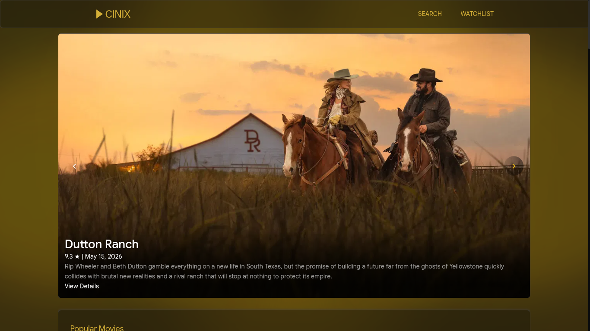
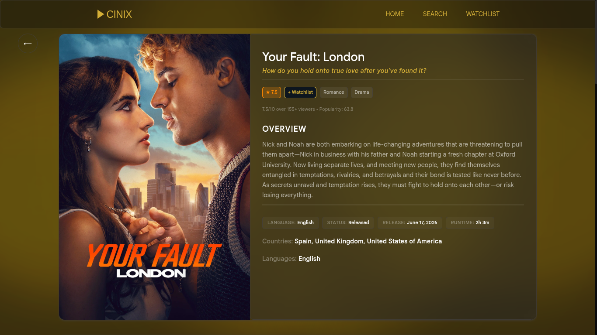
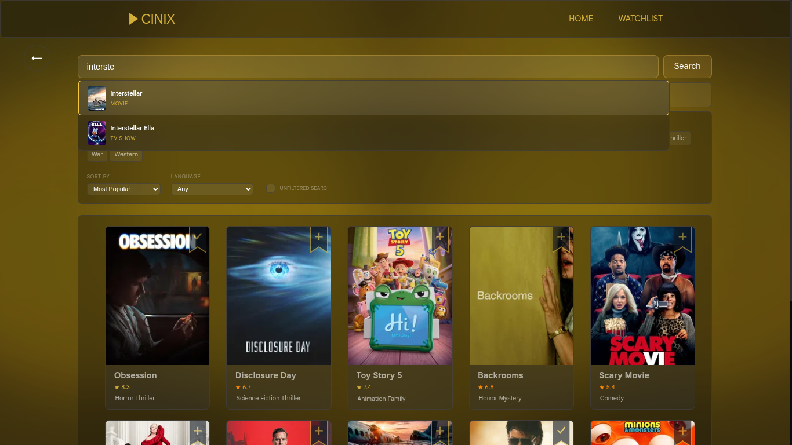
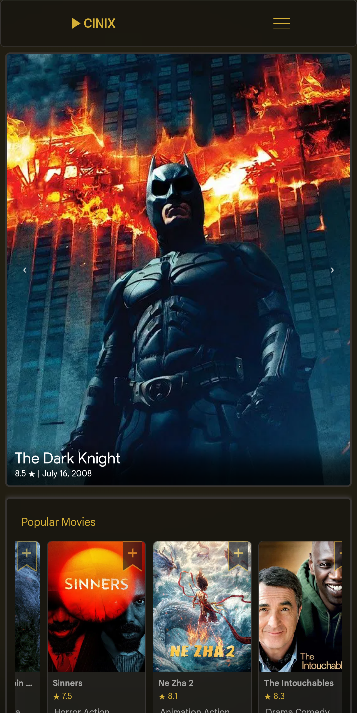

# 🎬 CINIX

> **Cinema, Curated.**

A modern movie discovery web application built with **Vanilla JavaScript**, designed around a clean, premium user experience. CINIX helps users discover movies and TV shows, explore hidden gems, and navigate content through an intuitive interface powered by **TMDB**.

🌐 **Live Demo:** https://cinix.netlify.app/

## 🚀 Engineering Highlights

- 🧩 **20 Modular JavaScript Components** — Built using a modular architecture with clearly separated responsibilities for pages, services, managers, factories, and utilities.

- 🧭 **URL-Driven Navigation** — Custom history routing with browser Back/Forward support, deep linking, and automatic scroll position restoration.

- ⚡ **Intelligent Request Handling** — Uses `AbortController` with request timeouts to cancel stale API requests, preventing unnecessary work and improving responsiveness.

- 🖼️ **Optimized Media Loading** — Lazy-loaded images, graceful fallbacks for missing artwork, and offline-friendly placeholders provide a consistent browsing experience.

- 📱 **Performance-Oriented Responsive Design** — Browser-aware rendering optimizations adapt visual effects for Firefox and mobile devices, preserving the application's visual identity while maintaining smooth performance.

- 💾 **Local Watchlist** — Stores watchlist data locally, allowing users to access and manage saved titles even when offline.

## 📸 Preview

### Home



---

### Movie Details



---

### Search



---

### Mobile



---

# ✨ Features

## 🎬 Discover

- Browse Movies & TV Shows
- Dynamic Hero Section
- Genre-based Navigation
- Rich Movie & TV Details
- Cast Information
- Company Pages
- Season & Episode Details

## 🔍 Search

- Instant Search
- Search Suggestions
- Debounced Input
- Keyboard Friendly

## ⭐ Personalization

- Local Watchlist
- Adult Content Filter
- Persistent User Preferences

## ⚡ User Experience

- Responsive Layout
- Browser Back & Forward Navigation
- Scroll Position Restoration
- Graceful Image Fallbacks
- Offline-friendly Watchlist
- Elegant Error Handling
- Loading States

---

# 🏗 Architecture

CINIX follows a modular architecture where every major responsibility is isolated into dedicated modules.

```
User
 │
 ▼
HistoryRoute
 │
 ▼
PageViewManager
 │
 ▼
Page
 │
 ▼
AppService
 │
 ▼
ApiService
 │
 ▼
TMDB API

────────────────────────────

Raw Response
 │
 ▼
DataHandler
 │
 ▼
DataFactory
 │
 ▼
CardFactory
 │
 ▼
DOM Rendering
```

## Core Responsibilities

### HistoryRoute

- URL-based navigation
- Browser Back/Forward support
- Scroll restoration
- Delegates page rendering

---

### PageViewManager

Acts as the application's rendering coordinator.

Responsible for:

- Active page rendering
- Loading UI
- Error UI
- Navigation delegation

---

### AppService

Provides a centralized service layer for pages.

Responsibilities:

- Communication with ApiService
- Data processing
- Common application services

---

### ApiService

The only module responsible for TMDB communication.

Responsibilities:

- API Requests
- Request timeout
- AbortController
- Error handling

---

### DataFactory

Transforms raw TMDB responses into CINIX's internal data model.

---

### CardFactory

Centralized reusable UI card generation.

---

# 📁 Project Structure

```text
Cinix
│
├── assets/
├── core/
│   ├── ApiService
│   ├── AppService
│   ├── CardFactory
│   ├── CardStore
│   ├── DataFactory
│   ├── DataHandler
│   ├── HeroManager
│   ├── HistoryRoute
│   ├── PageViewManager
│   ├── ScrollObserver
│   ├── UiFactory
│   ├── HomePage
│   ├── SearchPage
│   ├── MoviePage
│   ├── TvPage
│   ├── SeasonPage
│   ├── EpisodePage
│   ├── CastPage
│   ├── CompanyPage
│   └── WatchListPage
│
├── styles/
├── index.html
├── app.js
└── main.css
```

---

# ⚡ Performance

CINIX emphasizes practical frontend performance without introducing unnecessary complexity.

Implemented optimizations include:

- Lazy loading images
- Debounced search
- Throttled scroll events
- DocumentFragment rendering
- Card data caching
- Request cancellation using AbortController
- Browser-aware rendering optimizations
- Mobile-specific animation optimizations
- Firefox-specific visual optimizations
- Graceful fallback rendering

---

# 🎨 Design Philosophy

CINIX was designed around five principles:

- Minimal
- Clean
- Consistent
- Premium
- Content First

The interface intentionally avoids visual clutter and keeps the focus on discovering cinema.

---

# 🛠 Tech Stack

- HTML5
- CSS3
- Vanilla JavaScript (ES Modules)
- TMDB API
- LocalStorage

---

# 🚀 Getting Started

```bash
git clone https://github.com/MohithKanna/Cinix.git

cd Cinix
```

Open `index.html` using a local server.

---

# 🌍 Browser Support

- Chrome
- Firefox
- Chromium-based Browsers
- Mobile Browsers

---

# 📈 Future Improvements

- User Accounts
- Cloud Watchlists
- Reviews & Ratings
- Advanced Recommendation Engine
- Search by Production Company
- Backend Integration

---

# 🙏 Acknowledgements

Movie data is provided by **TMDB**.

This product uses the TMDB API but is not endorsed or certified by TMDB.

---

# 📚 Lessons Learned

CINIX became much more than a movie discovery application.

Building it reinforced the importance of:

- Shipping over endless perfection
- Architectural separation
- Performance optimization
- Browser compatibility
- Progressive enhancement
- Thoughtful user experience
- Engineering trade-offs

Most importantly, it established a personal quality benchmark for future projects. Every project that follows will be expected to improve upon the standards set while building CINIX.

---

# 📄 License

This project is currently released without an explicit open-source license.
